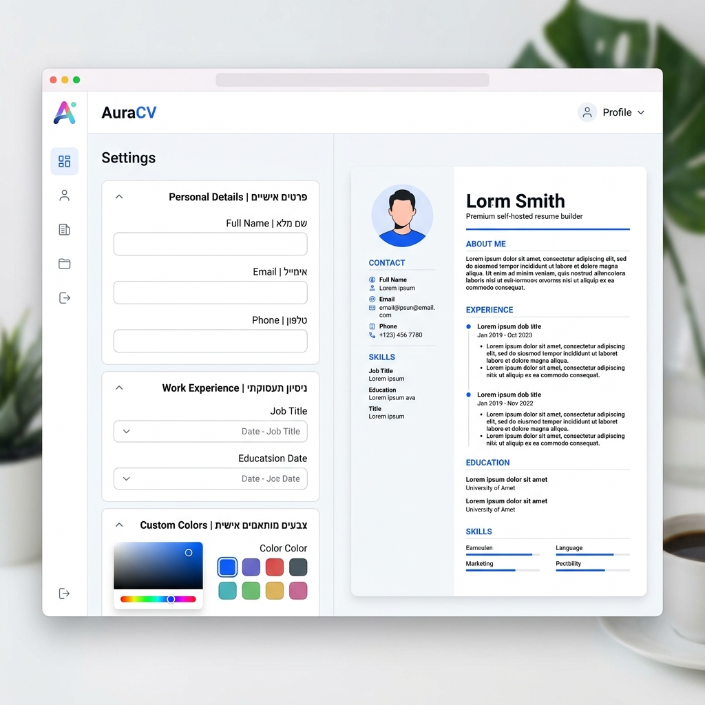
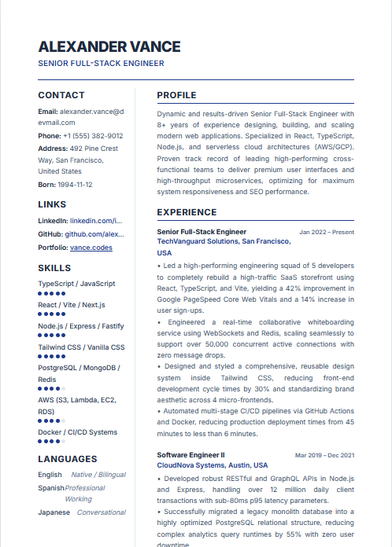

# AuraCV (Self-Hosted Resume Builder)

[](https://nodejs.org/)
[](https://react.dev/)
[](https://tailwindcss.com/)
[](https://vite.dev/)
[](https://pptr.dev/)
[](https://opensource.org/licenses/MIT)

A self-hosted, pixel-perfect, and fully responsive **AuraCV** resume builder. Build, edit, and export professional, ATS-compliant, and vector-based resumes instantly. 

This repository is built as a highly optimized TypeScript monorepo combining a fast React 19 frontend with a robust Puppeteer-powered PDF generation microservice.

---

## Screenshots

| AuraCV Editor Dashboard | High-Fidelity PDF Export Preview |
| :---: | :---: |
|  |  |

---

## Features

- **Real-time Reactive Form Editor**: Update personal details, professional experience, education, skills, and languages with instant UI updates.
- **Modern Visual Templates**: Choose between multiple professionally designed templates (Creative, Professional, Modern, etc.) powered by Tailwind CSS v4.
- **High-Fidelity PDF Export**: Generate 100% ATS-compliant, vector-based, selectable-text PDFs using a server-side headless browser.
- **Tailwind CSS Integration**: Dynamic server-side stylesheet compilation ensures that PDF output matches the web preview down to the pixel.
- **Monorepo Architecture**: Clean separation of concerns with a shared type system between the client and server.

---

## Repository Architecture

The project is structured as an NPM workspace monorepo:

```text
├── client/          # Vite 6 + React 19 SPA (frontend)
├── server/          # Node.js + Express + Puppeteer service (backend)
├── shared/          # Common TypeScript interfaces & CV schemas
├── env.example      # Sample environment configuration file
├── package.json     # Root package.json managing workspaces
└── tsconfig.json    # Global TypeScript compiler options
```

- **`shared`**: Defines the `CVData` schema, guaranteeing strict contract safety between client form state and server-side templates.
- **`client`**: Hosts the interactive React state, visual forms, and template previews.
- **`server`**: Renders React templates into semantic HTML using server-side rendering (SSR), compiles the dynamic Tailwind CSS, and uses headless Chromium via **Puppeteer** to print high-quality A4 vectors.

---

## Quick Start

### Prerequisites

Ensure you have the following installed on your machine:
- **Node.js** (v18 or higher recommended)
- **NPM** (v9 or higher for workspace support)

### 1. Clone the Repository
```bash
git clone https://github.com/yourusername/resume-builder.git
cd resume-builder
```

### 2. Install Dependencies
Install all package dependencies for the entire monorepo in one command:
```bash
npm run install:all
```

### 3. Environment Setup
Configure your environment variables before booting the servers:
```bash
cp env.example .env
```
Open the `.env` file and adjust the ports or settings as needed. See [Environment Variables](#-environment-variables) below for details.

### 4. Run the Development Servers
Launch both the **Vite frontend** and **Express backend** concurrently:
```bash
npm run dev
```

- **Frontend Application**: `http://localhost:5173`
- **Backend API Service**: `http://localhost:3001`

---

## 💻 Local Desktop Application (Windows & macOS)

AuraCV features a native standalone desktop wrapper powered by **Electron**. This allows you to run AuraCV as a fully offline, high-performance desktop application directly on your computer without managing separate server endpoints.

### 🌟 Why use the Desktop App?
- **100% Offline-First**: Build and edit resumes completely offline. Your personal data is never transmitted over the network; it resides solely on your disk.
- **Native PDF Rendering**: Uses Chromium's low-level print engine directly inside Electron for crisp, pixel-perfect, vector-based A4 PDF exports.
- **Auto Font-Caching**: Automatically downloads required Google Fonts locally to ensure templates render correctly, even when completely offline.
- **Native File Dialogs**: Easily import and export your resume backup `.json` configurations using standard OS Save/Open dialogues.

### 🛠️ Developer Mode & Startup
To run the desktop application locally in developer mode:
1. Ensure your Vite development server is running (`npm run dev:client`).
2. Launch Electron in development mode:
   ```bash
   npm run desktop:start
   ```

### 📦 Packaging Standalone Native Installers
You can build standalone, zero-dependency executable packages for both Windows and macOS:

#### 🪟 Windows (NSIS Installer)
Compile a standard Windows installer (`.exe`):
```bash
npm run desktop:pack:win
```
*Outputs a clean installer setup file in `desktop/dist/` that installs shortcuts on your Desktop and Start Menu.*

#### 🍏 macOS (DMG / ZIP Bundle)
Compile native macOS application bundles:
```bash
npm run desktop:pack:mac
```
*Outputs a `.dmg` installer and a `.zip` package in `desktop/dist/` categorized under productivity.*

---

## Environment Variables

The project uses environment configurations to run across different ports and hostings. Here are the variables defined in `env.example`:

| Variable | Description | Default |
| :--- | :--- | :--- |
| `PORT` | The port the Express API and Puppeteer PDF renderer listens on | `3001` |
| `NODE_ENV` | Mode of operation (`development` or `production`) | `development` |
| `VITE_PORT` | The local development server port for Vite | `5173` |
| `VITE_API_URL` | Endpoint of the backend server (used for client requests) | `http://localhost:3001` |

---

## Building & Deploying to Production

To build the monorepo for production:

1. **Build all packages** (compiles TypeScript and bundles React assets):
   ```bash
   npm run build
   ```
2. **Start the production server**:
   ```bash
   npm run dev:server
   ```
   *Note: In production, the backend is capable of locating and serving the pre-compiled production CSS from the client's built assets, reducing overhead and guaranteeing visual consistency.*

---

## Security & Best Practices

- **Base64 Payload Handling**: The server is configured to accept JSON payloads up to `50mb` to handle heavy user profiles and profile pictures in Base64 encoding.
- **Puppeteer Sandboxing**: Running Puppeteer in containerized environments requires specific flags. The backend launch arguments include `--no-sandbox` and `--disable-setuid-sandbox` for seamless Docker deployment.
- **Git Tracking Safety**: Sensitive environment files (`.env`, local overrides) are excluded in `.gitignore` to prevent secret leaking.

---

## License & Copyright

This project is licensed under the MIT License. See the [LICENSE](file:///d:/resume_builder/LICENSE) file for details.

```text
Copyright (c) 2026 Eli. All rights reserved.
```

Permission is hereby granted, free of charge, to any person obtaining a copy of this software and associated documentation files (the "Software"), to deal in the Software without restriction, including without limitation the rights to use, copy, modify, merge, publish, distribute, sublicense, and/or sell copies of the Software.
